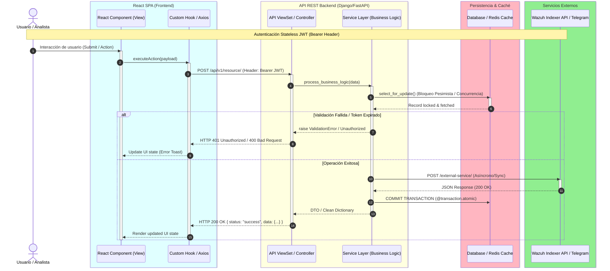
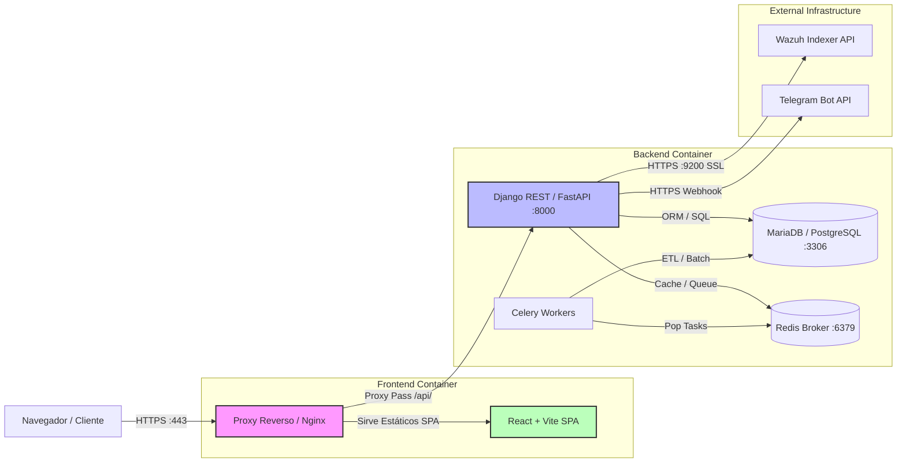

# 📚 Skill: Documentación Viva, Arquitectura y APIs (Estándar Enterprise Scrum)

Esta skill establece las convenciones estrictas e innegociables para mantener la documentación del proyecto **sincronizada en tiempo real con el código**, integrándola al flujo agil de Scrum como parte de la **Definición de Hecho (DoD)** de cada Sprint.

---

## 1. Filosofía: Living Documentation en Scrum

1. **Documentación como Entregable del Sprint:** La documentación NO es una tarea de final de proyecto. Si una Historia de Usuario (`US-XX`) se marca como terminada pero su contrato Swagger, diagrama de secuencia o manual técnico no fue actualizado → **el Pull Request no se aprueba**.
2. **Trazabilidad Orgánica (Mapping Chain):**
   $$\text{Caso de Uso (SRS v6)} \longrightarrow \text{Historia de Usuario (US-XX)} \longrightarrow \text{Endpoint API REST} \longrightarrow \text{Esquema Swagger} \longrightarrow \text{Test QA (OWASP)}$$
3. **Decoupled Architecture First:** Toda la documentación debe reflejar la separación estricta:
   - **Frontend:** Single Page Application (React + Vite)
   - **Backend:** API REST Stateless (Django DRF / FastAPI) con Bearer Tokens (JWT)

---

## 2. Estándar de Diagramación (Mermaid & MER)

### 2.1 Diagrama de Secuencia (Mermaid `sequenceDiagram`)

Todo diagrama de secuencia debe cumplir obligatoriamente con la siguiente estructura y elementos de diseño:

#### Reglas de Estilo y Sintaxis:
- **`autonumber`**: Activado obligatoriamente en la primera línea.
- **`box` por Capa de Arquitectura (Nomenclatura Decoupled)**:
  - `box LightCyan React SPA (Frontend)` → Componentes, Hooks, Axios.
  - `box LightYellow API REST Backend` → Views/ViewSets, Service Layer.
  - `box LightPink Persistencia & Caché` → ORM Models, Database, Redis.
  - `box LightGreen Servicios Externos & Sec` → Wazuh API, Telegram Bot, SMTP, JWT Store.
- **`activate` / `deactivate`**: Obligatorio en cada llamada asíncrona o bloque procesador para visualizar tiempos de vida.
- **`alt` / `else`**: Documentar siempre los flujos de error, fallas de autenticación (401/403) y validaciones de negocio.
- **`loop`**: Obligatorio para operaciones iterativas (ej. procesamiento de batch de logs, carritos de items).
- **Notas de Seguridad (`Note right of X`)**: Vincular explícitamente mitigaciones de vulnerabilidades (ej. `CWE-200 Prevención de Enumeración`, `OWASP A01 Access Control`).

#### Plantilla Canónica de Diagrama de Secuencia:



### 2.2 Diagrama de Arquitectura de Componentes (Mermaid `graph LR`)

Toda vista general de arquitectura debe diagramarse con la topología de contenedores y puertos:



### 2.3 Modelo Entidad-Relación (MER)

- **Herramienta Maestra:** `dbdiagram.io` con enlace interactivo directo en `docs/diccionario-datos.md`.
- **Regla:** Cada nueva migración ORM en Django debe reflejarse inmediatamente en el diagrama interactivo de `dbdiagram.io` agregando la tabla, campos, PKs, FKs e índices.
- **Formato en Markdown:**
  ```markdown
  > 🗄️ **Modelo MER Interactivo:** [dbdiagram.io/d/HoneyMetrics-MER](https://dbdiagram.io/d/HoneyMetrics-MER)
  ```

---

## 3. Tipos de Documentos y su Estándar de Exigencia

### 3.1 Manual Técnico (`docs/manual-tecnico.md`)
Dirigido a **DevOps, SysAdmins y DBAs**. Debe contener obligatoriamente:

1. **Tabla de Servidores y Entornos:**
   | Entorno | Host / IP | Sistema Operativo | Puertos / Acceso | SSH User |
   |---|---|---|---|---|
   | 🚀 Producción | `honey.johan-d3v.site` | Ubuntu Server 24.04 LTS | HTTP `:80`, HTTPS `:443` | `sebas` |
   | 🛡️ Honeypot Agente | `192.168.1.100` | Armbian (Orange Pi 5) | SSH `:22` | `root` |

2. **Requisitos Mínimos de Hardware:**
   - CPU Cores, Memoria RAM (Mínima y Recomendada), Espacio en Disco SSD, Ancho de Banda.

3. **Matriz Exhaustiva de Localización de Cambios:**
   Tabla que mapea "si necesitas cambiar X funcional/técnico → modifica el archivo Y en la ruta Z":
   | Categoría | Requerimiento Técnico | Componente / Archivo | Ruta Relativa |
   |---|---|---|---|
   | 🎨 Frontend | Modificar paleta de colores del Dashboard | CSS Tokens / Tailwind | `frontend/src/styles/theme.css` |
   | 🔐 Auth | Cambiar expiración de tokens JWT | Settings Django | `core/HoneyMetrics_Project/settings.py` |

4. **Sección "El Por Qué Técnico" (Decisiones de Ingeniería):**
   Documentar las razones de diseño (ej. Cache Busting, Locking pesimista, Signals bypass en seeding, Logging vs print).

5. **Cheatsheet de Comandos:**
   Bloques de código bash copiables para levantar Docker, ejecutar migraciones, tests y despliegue.

### 3.2 Manual de Usuario (`docs/manual-usuario.md`)
Dirigido a **Directivos, Consultores y Analistas de Datos**:
- Pantallazos reales (``).
- Guías paso a paso de cada Caso de Uso operado desde el Frontend React.
- Sección de Preguntas Frecuentes (FAQ) y resolución de mensajes de error de la UI.

### 3.3 Diccionario de Datos (`docs/diccionario-datos.md`)
- Enlace al MER interactivo (`dbdiagram.io`).
- Tablas detalladas con: Nombre del campo, Tipo SQL, Nullable, Clave (PK/FK), Descripción de negocio.
- Documentación de Triggers, Stored Procedures y Celery Cron Tasks.

### 3.4 Referencia API REST (Swagger / OpenAPI)
- Decoradores en cada ViewSet (`drf-spectacular`): `@extend_schema(summary=..., request=..., responses={...})`.
- **Los 7 Códigos HTTP de Respuesta Documentados Explicítamente:**
  - `200 OK`: Operación exitosa (lectura/actualización).
  - `201 Created`: Recurso creado exitosamente.
  - `400 Bad Request`: Error de validación en los datos de entrada (JSON schema).
  - `401 Unauthorized`: Token JWT ausente, expirado o inválido.
  - `403 Forbidden`: El usuario autenticado no posee el rol necesario (RBAC).
  - `404 Not Found`: Recurso solicitado no existe.
  - `500 Internal Server Error`: Fallo no controlado del servidor.

---

## 4. Bridge SRS v6 $\rightarrow$ Scrum (Historias de Usuario BDD)

Cada Caso de Uso heredado del SRS v6 debe traducirse a una Historia de Usuario con criterios de aceptación en formato **Gherkin (Given-When-Then / BDD)**:

```gherkin
Feature: CU-DASH-01 Visualización de Métricas del Honeypot
  As a Directivo de T.I.
  I want to visualizar el dashboard interactivo de alertas
  So that pueda evaluar la superficie de ataques en tiempo real

  Scenario: Carga exitosa del Dashboard con Wazuh Online
    Given el usuario está autenticado con rol "Directivo T.I." y posee JWT válido
    When el usuario navega a la ruta "/dashboard" en la SPA de React
    And el servicio Wazuh Indexer responde en menos de 3 segundos
    Then la SPA muestra los KPIs de "Total Alertas" y "Promedio Severidad"
    And los gráficos de Plotly (Distribución por Regla y Línea de Tiempo) se renderizan correctamente
    And la API responde con código HTTP 200 OK
```

---

## 5. Correcciones Arquitectónicas Obligatorias sobre el SRS v6

Al procesar o documentar requerimientos del archivo `HoneyMetrics_INGSW-Requerimientos_Actualizados_v6.md`, el agente **debe aplicar las siguientes correcciones**:

1. **Eliminación Definitiva de Streamlit $\rightarrow$ JavaScript + Plotly.js (Monolito y SPA Decoupled):**
   - *Verificación Técnica:* El análisis del código fuente confirma que Streamlit **JAMÁS se usó en el proyecto**. Toda la capa de dashboards (`core/dashboard/static/dashboard/js/main.js`) está implementada 100% en el cliente con **JavaScript y Plotly.js (`plotly-2.27.0.min.js`)** consumiendo endpoints JSON.
   - *Acción:* Se eliminan todas las menciones a Streamlit en el SRS v6 y en la documentación técnica, registrando que las visualizaciones de mapas de calor (`CU-DASH-02`) y matrices de confusión (`CU-DASH-03`) son componentes interactivos de Plotly.js alimentados por APIs REST.

2. **CU-G-03 (Acceder al Panel Admin Django) $\rightarrow$ Documentación Académica con Warning:**
   - *Motivo:* Exponer `/admin/` en especificaciones públicas es un riesgo de seguridad en producción.
   - *Acción:* Se mantiene documentado exclusivamente por requerimiento académico del docente, pero **debe incluir una nota de advertencia explicita**:
     > ⚠️ **ADVERTENCIA DE SEGURIDAD (Anti-Patrón):** La interfaz nativa de Django Admin `/admin/` se incluye en este documento únicamente para fines de evaluación académica. En entornos de producción real bajo arquitectura API-First, la administración se realiza a través del Dashboard en React y la ruta `/admin/` debe ser restringida por IP o deshabilitada.

3. **Inexistencia de Mockup en Figma (Agilismo & Compensación Estética IA):**
   - Para acelerar el desarrollo agil, NO se exigirá un mockup en Figma como bloqueante del Sprint.
   - **Compensación por IA:** Para suplir la ausencia de mockup, el agente debe proponer y estructurar activamente la arquitectura de la interfaz en la documentación y en el desarrollo:
     - Definición de paleta de colores empresarial (Tailwind / CSS Variables).
     - Componentes UI/UX responsivos (tarjetas KPI, micro-animaciones, estados de carga con Skeleton loaders).
     - UX resiliente (modales de confirmación, toasts intuitivos, 0% stacktraces expuestos).

4. **Desacoplamiento de Lenguaje:**
   - Reemplazar frases como *"Renderiza la vista Django template_name.html"* por *"La API emite payload JSON y el componente React actualiza el estado DOM"*.

---

## 6. ConfiguraciónMkDocs Estándar (`mkdocs.yml`)

El archivo `mkdocs.yml` debe usar el tema Material con todas sus capacidades avanzadas:

```yaml
site_name: HoneyMetrics — Documentación de Arquitectura y Operaciones
site_description: Documentación viva de la plataforma HoneyMetrics (API REST + React SPA)
site_author: Johan Sebastián Posada Beltrán

theme:
  name: material
  language: es
  palette:
    - media: "(prefers-color-scheme: light)"
      scheme: default
      primary: amber
      accent: gold
      toggle:
        icon: material/weather-sunny
        name: Cambiar a modo oscuro
    - media: "(prefers-color-scheme: dark)"
      scheme: slate
      primary: amber
      accent: gold
      toggle:
        icon: material/weather-night
        name: Cambiar a modo claro
  features:
    - navigation.tabs
    - navigation.sections
    - navigation.top
    - search.suggest
    - search.highlight
    - content.code.copy

plugins:
  - search
  - mermaid2:
      arguments:
        panzoom: true

markdown_extensions:
  - admonition
  - pymdownx.details
  - pymdownx.superfences:
      custom_fences:
        - name: mermaid
          class: mermaid
          format: !!python/name:mermaid2.fence_mermaid
  - pymdownx.tabbed:
      alternate_style: true
  - pymdownx.tasklist:
      custom_checkbox: true
  - pymdownx.highlight:
      anchor_linenums: true
  - attr_list
  - tables
```

---

## 7. Checklist DoD (Definición de Hecho) por Sprint

Antes de marcar cualquier tarea de documentación o funcionalidad como completada, el agente debe verificar:

- [ ] **Trazabilidad:** La Historia de Usuario está vinculada a su CU del SRS v6.
- [ ] **Gherkin:** Contiene al menos 1 escenario `Given-When-Then`.
- [ ] **Swagger/OpenAPI:** Todos los endpoints nuevos tienen decorador con los 7 códigos HTTP.
- [ ] **Diagrama de Secuencia:** Creado o actualizado con `autonumber`, `box` por capa y `activate/deactivate`.
- [ ] **Diagrama de Componentes / MER:** Si hubo nueva migración, `dbdiagram.io` está actualizado.
- [ ] **Manual Técnico:** Tabla de localización de cambios actualizada con las rutas de los nuevos archivos.
- [ ] **Figma / AI UX:** Si no hay mockup en Figma, se incluye la propuesta de diseño UI/UX (colores, componentes, responsive) generada por la IA.
