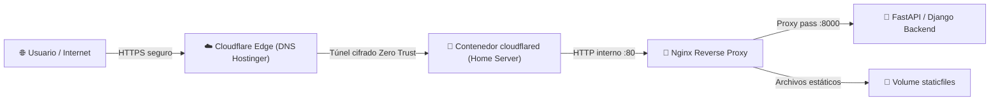

# 🚀 Global DevOps & Deployment Standard (Docker, Nginx & Cloudflare)

Esta Skill estandariza el flujo de contenerización y despliegue para cualquier proyecto (FastAPI, Django, React, Express, etc.).

---

## 1. La Trilogía de Docker Compose

Todo proyecto debe implementar la separación en 3 capas:

```
proyecto/
├── Dockerfile                   # Multi-stage build (Builder -> Non-root runner)
├── docker-compose.yml           # Base común (Servicios, volúmenes, healthchecks)
├── docker-compose.override.yml  # Dev Local (Live Reload, puertos abiertos, docs)
└── docker-compose.prod.yml      # Prod/Staging (Nginx, ASGI/WSGI multi-worker, Cloudflared)
```

### A. `docker-compose.yml` (Base Inmutable)
- Define los nombres de contenedores, redes y volúmenes con nombre (`db_data`, `media_data`, `static_data`).
- Define `healthcheck` obligatorio en la base de datos antes de que la aplicación web inicie.
- Usa variables de entorno desde `.env`.

### B. `docker-compose.override.yml` (Desarrollo Local)
- Se ejecuta automáticamente con `docker compose up`.
- Mapea el código fuente local al contenedor (`.:/app`) para **Live Reload**.
- Expone puertos directos al host (`8000:8000` web, `5173:5173` frontend, `3306/1433/5432` BD para DBeaver).
- Incluye servicios opcionales de desarrollo (ej. MkDocs en puerto `8001`).

### C. `docker-compose.prod.yml` (Staging / Home Server / Cloud)
- Se ejecuta con: `docker compose -f docker-compose.yml -f docker-compose.prod.yml up -d --build`
- **Cero puertos de backend expuestos al host:** Usar `expose` interno hacia la red Docker.
- **Servidor de Producción:** Gunicorn con Uvicorn workers (`uvicorn.workers.UvicornWorker` para FastAPI) o Gunicorn WSGI (`core.wsgi:application` para Django).
- **Proxy Inverso Nginx:** Sirve estáticos y multimedia directamente en caché y redirige `/api/` al backend.
- **Túnel Cloudflare (`cloudflared`):** Integrado mediante `profiles: - tunnel`.
- **Política de Reinicio:** `restart: unless-stopped` para alta disponibilidad tras caídas de energía o reboots del servidor.

### D. ⚠️ Regla Estricta: Política de 'restart' (Protección de Discos Externos / Exdrive)
- **EN DESARROLLO (`base` y `override`):** Obligatorio **`restart: "no"`**.
  - *Causa Crítica:* En sistemas Linux con unidades externas o montajes en `/media/usuario/Exdrive`, si un contenedor tiene `restart: always` o `unless-stopped`, el daemon de Docker (`dockerd`) arranca al bootear **antes** de que el sistema operativo monte el disco externo. Docker crea la carpeta `/media/usuario/Exdrive` vacía como `root`, secuestrando el punto de montaje y obligando al SO a montar el disco real como `/media/usuario/Exdrive1`.
  - *Regla de Oro:* En local, los contenedores **solo** se inician cuando el desarrollador escribe `docker compose up` y nunca automáticamente con el sistema.
- **EN PRODUCCIÓN (`prod`):** Permitido **`restart: unless-stopped`** únicamente porque los discos del servidor son fijos y se requiere auto-recuperación.

---

## 2. Dockerfile Multi-Etapa Seguro (Standard Multi-Stage)

```dockerfile
# ETAPA 1: Build de dependencias (Compilación)
FROM python:3.12-slim AS builder
WORKDIR /app
COPY requirements.txt .
RUN pip install --upgrade pip && \
    pip install --no-cache-dir --prefix=/install -r requirements.txt

# ETAPA 2: Runtime Final de Producción (Seguridad Non-Root)
FROM python:3.12-slim
ENV PYTHONDONTWRITEBYTECODE=1 \
    PYTHONUNBUFFERED=1

# Crear usuario sin privilegios
RUN useradd -m -r -u 1001 appuser && \
    mkdir -p /app/staticfiles /app/media && \
    chown -R appuser:appuser /app

WORKDIR /app
COPY --from=builder /install /usr/local
COPY --chown=appuser:appuser . .

USER appuser
EXPOSE 8000
```

---

## 3. Despliegue en Servidor Casero (`sebas@192.168.33.2`) con Cloudflare & Hostinger



### Configuración Paso a Paso:
1. **Crear Túnel en Cloudflare Zero Trust Dashboard:**
   - Crear túnel tipo `Cloudflared` y copiar el `CLOUDFLARE_TUNNEL_TOKEN`.
   - Asignar Public Hostname: `app.johan-d3v.site` ➔ `http://nginx:80` (en la red Docker).
2. **DNS en Hostinger:**
   - Apuntar los NameServers del dominio a Cloudflare para gestión automática de SSL/TLS y CNAMEs.
3. **Despliegue en Servidor:**
   ```bash
   # En tu servidor local (192.168.33.2)
   cd /ruta/al/proyecto
   docker compose -f docker-compose.yml -f docker-compose.prod.yml --profile tunnel up -d --build
   ```

---

## 4. Evaluación de Opciones de Despliegue

| Opción | Ideal Para | Ventajas | Consideraciones / Costos |
| :--- | :--- | :--- | :--- |
| **Home Server (`192.168.33.2`) + Cloudflare** | Demos, Tesis, Entornos de prueba y Honeypots reales | Costo $0, hardware propio con GPU/Wazuh, sin límites de CPU/RAM | Depende de la estabilidad eléctrica y conexión del hogar. |
| **Azure for Students (Cloud)** | API Backend en la nube / Evaluación del Profesor | $100 USD anuales gratis, SLA corporativo, alta disponibilidad | Requiere optimizar consumo de instancias (App Services / B1s VMs). |
| **Vercel / Cloudflare Pages** | Frontend React SPA | Despliegue automático con cada `git push`, CDN global ultra rápido, Costo $0 | Solo para código estático (SPA). La API debe estar en otro host. |

---

## 5. Checklist de Seguridad Pre-Despliegue
- [ ] `DEBUG=False` configurado en `.env`.
- [ ] La base de datos NO expone puertos al exterior en `docker-compose.prod.yml`.
- [ ] El contenedor corre bajo el usuario `appuser` (non-root).
- [ ] Nginx tiene configurados límites de tamaño de subida (`client_max_body_size`) y headers de seguridad (`X-Frame-Options`, `X-Content-Type-Options`).
- [ ] `CLOUDFLARE_TUNNEL_TOKEN` está protegido en `.env` y nunca subido a GitHub.
