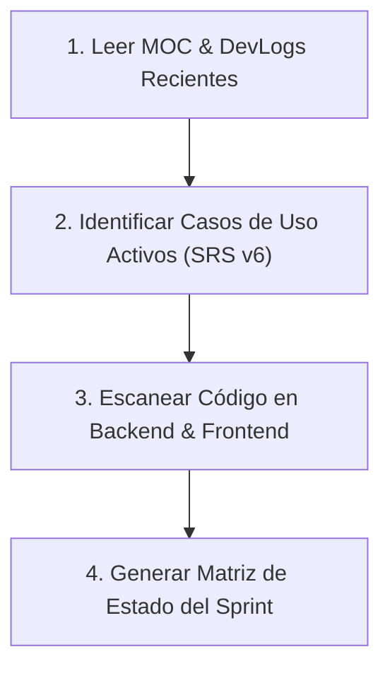

# 🧠 Vault Context Synchronization & Project Memory Engine

Esta Skill se encarga de rehidratar y reconstruir el contexto completo del proyecto **HoneyMetrics 2.0** cuando se inicia una nueva conversación, se reinicia la sesión o un nuevo desarrollador se une al proyecto.

---

## 🗺️ 1. Rutas de la Fuente de Verdad (Single Source of Truth)

La memoria del proyecto reside en la bóveda de Obsidian:
* **Bóveda:** `/media/sebas/Exdrive/mi_obsidian/vault_obsidian/`
* **Mapa Maestro (MOC):** `20_Proyectos/HoneyMetrics/HoneyMetrics-MOC.md`
* **Especificación de Requerimientos:** `20_Proyectos/HoneyMetrics/HoneyMetrics_INGSW-Requerimientos_Actualizados_v6.md` (4.795 líneas, Casos de Uso CU-G-01 hasta CU-ADM-XX).
* **Análisis de Datos Reales:** `20_Proyectos/HoneyMetrics/HoneyMetrics-Analisis-Exhaustivo-Datos-Reales.md` (165.247 logs de Wazuh).
* **Bitácoras (DevLogs):** `20_Proyectos/HoneyMetrics/DevLogs/`
* **Estándares y Skills:** `20_Proyectos/HoneyMetrics/HoneyMetrics-Skills-y-Estandares-Ingenieria.md`

---

## 🔍 2. Protocolo de Sincronización en 4 Pasos

Cuando el usuario pida *"analizar la bóveda"*, *"recuperar contexto"* o se inicie un sprint:

### Paso 1: Lectura de Decisiones Recientes
Inspeccionar los últimos DevLogs en `20_Proyectos/HoneyMetrics/DevLogs/` para recordar:
- Qué decisiones de arquitectura se tomaron.
- Qué problemas o bloqueos se resolvieron en la jornada anterior.

### Paso 2: Validación de Reglas de Negocio e Invariantes
Revisar en el documento SRS v6 los criterios de aceptación (*Given-When-Then*), actores y flujos de excepción del módulo en desarrollo.

### Paso 3: Inspección del Código Real
Revisar el estado de los repositorios:
- Backend: `/media/sebas/Exdrive/Workspace/honeymetrics-backend`
- Frontend: `/media/sebas/Exdrive/Workspace/honeymetrics-frontend`
- V1 Legacy (Referencia): `/media/sebas/Exdrive/Workspace/HoneyMetrics`

### Paso 4: Síntesis Ejecutiva
Entregar al usuario un resumen conciso:
1. **Estado Actual:** Qué módulos están 100% terminados y testeados.
2. **Siguiente Tajada Vertical:** Qué endpoint + vista + tests se construirán hoy.
3. **Alertas de Integridad:** Si hay discrepancias entre la documentación y el código.
