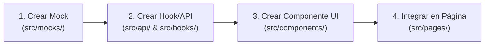

# 🚀 Guía de Primeros Pasos — HoneyMetrics Frontend SPA

¡Bienvenido al equipo de desarrollo de **HoneyMetrics Frontend**! Esta guía está pensada para que cualquier desarrollador clone el repositorio, comprenda la estructura de la Single Page Application (SPA) y pueda empezar a construir interfaces de usuario de inmediato.

---

## 📋 1. Requisitos Previos

Solo necesitas tener instalado:
* **Git** (`git --version`)
* **Docker & Docker Compose** (`docker compose version`)

> [!TIP]
> **No necesitas tener Node.js ni npm instalados en tu PC.** Todas las dependencias, el compilador SWC (Rust) y el servidor de desarrollo corren dentro de contenedores Docker aislados.

---

## ⚡ 2. Inicio Rápido con Docker (En 2 Pasos)

### Paso 1: Clonar el repositorio
```bash
git clone git@github.com:johanP051/honeymetrics-frontend.git
cd honeymetrics-frontend
```

### Paso 2: Levantar el entorno de desarrollo con Live Reload
```bash
docker compose up --build
```

¡Listo! Abre en tu navegador:
* 🌐 **Aplicación Web:** [http://localhost:5173](http://localhost:5173)

> [!NOTE]
> **Fast Refresh con SWC Activo:** Vite compila con SWC en milisegundos. Cuando edites cualquier archivo en `src/`, el cambio se verá reflejado instantáneamente en el navegador sin recargar toda la página.

---

## 🔌 3. El Sistema de Mocks Offline (Desarrollo Desacoplado)

Una de las grandes ventajas de este proyecto es que **puedes programar toda la interfaz incluso si el backend está apagado o en mantenimiento**:

* Si el Backend está activo en `http://localhost:8000`: La UI mostrará el badge **"🟢 API en Vivo"**.
* Si el Backend está apagado: El hook `useThreats` conmutará automáticamente a **"🟡 Modo Mock (Offline)"** usando los datos de `src/mocks/threatsMockData.js`.
* Puedes forzar el cambio manualmente con el botón en el banner superior para probar cómo se comporta la UI en ambos escenarios.

---

## 📁 4. Mapa de la Estructura del Proyecto

```
honeymetrics-frontend/
├── public/                           # Archivos estáticos servidos directamente
│   └── favicon.svg                   # Icono de la plataforma
│
├── src/                              # Código fuente principal de React
│   ├── api/                          # CAPA DE TRANSPORTE HTTP
│   │   ├── client.js                 # Instancia de Axios configurada con base URL y timeouts
│   │   └── threatsApi.js             # Funciones de consumo de endpoints REST
│   │
│   ├── components/                   # COMPONENTES DE INTERFAZ REUTILIZABLES
│   │   ├── layout/                   # Componentes de estructura global
│   │   │   ├── Navbar.jsx            # Barra superior con avatar y estado de conexión
│   │   │   └── StatusBanner.jsx      # Banner indicador de Modo Live vs Mock
│   │   ├── threats/                  # Componentes específicos del dominio CTI
│   │   │   ├── ThreatScoreCard.jsx   # Tarjeta de IP atacante con puntaje de amenaza
│   │   │   └── BotnetAlertBadge.jsx  # Alerta de bloqueo de subred CIDR
│   │   └── index.js                  # Barrel export para importar componentes limpiamente
│   │
│   ├── context/                      # ESTADO GLOBAL DE REACT (Context API)
│   │   └── AuthContext.jsx           # Proveedor de sesión y autenticación
│   │
│   ├── hooks/                        # CUSTOM HOOKS DE REACT
│   │   └── useThreats.js             # Hook de consumo de datos con soporte de Mocks
│   │
│   ├── mocks/                        # DATOS DE SIMULACIÓN OFFLINE
│   │   └── threatsMockData.js        # Dataset de prueba basado en 165k logs reales
│   │
│   ├── pages/                        # VISTAS Y PANTALLAS COMPLETAS
│   │   └── DashboardPage.jsx         # Vista orquestadora del dashboard de analítica
│   │
│   ├── utils/                        # FORMATEADORES Y FUNCIONES AUXILIARES
│   │   └── formatters.js             # Formato de números, colores y etiquetas
│   │
│   ├── App.jsx                       # Componente raíz
│   ├── main.jsx                      # Punto de entrada ReactDOM
│   └── index.css                     # Sistema de diseño y variables CSS (Dark Theme)
│
├── docs/                             # DOCUMENTACIÓN TÉCNICA
│   └── primeros_pasos.md             # Esta guía que estás leyendo
│
├── Dockerfile                        # Multi-stage: Dev (Node) / Prod (Nginx)
├── docker-compose.yml                # Base común
├── docker-compose.override.yml       # Configuración para desarrollo local
├── docker-compose.prod.yml           # Configuración de producción con Nginx
├── nginx.conf                        # Configuración de Nginx para SPA (try_files)
├── package.json                      # Dependencias y scripts de npm
└── vite.config.js                    # Configuración de Vite con plugin SWC
```

---

## 🛠️ 5. Flujo de Trabajo: ¿Cómo agregar un nuevo componente o pantalla?

Seguimos la filosofía de **Componentes Atómicos y Desacoplados**:



1. **Mock (`src/mocks/`):** Si el endpoint aún no existe en el backend, define los datos simulados en un archivo JS.
2. **Servicio API & Hook (`src/api/` y `src/hooks/`):** Crea la función Axios y el Custom Hook con fallback a los datos mock.
3. **Componente (`src/components/`):** Crea el componente puramente visual en la subcarpeta que corresponda (`layout/`, `threats/`, `common/`).
4. **Página (`src/pages/`):** Importa los componentes y el hook para armar la vista completa.

---

## 🚀 6. Modo Producción / Servidor Nginx Local

Para probar cómo correrá la aplicación en producción (compilada como archivos estáticos optimizados y servida por Nginx):

```bash
docker compose -f docker-compose.yml -f docker-compose.prod.yml up -d --build
```
Abre en tu navegador: [http://localhost:8080](http://localhost:8080)

Para detener los contenedores:
```bash
docker compose down
```

---

## 🤝 Enlaces y Referencias
* 📘 [Repositorio Backend](https://github.com/johanP051/honeymetrics-backend)
* ⚡ [Documentación de Vite](https://vitejs.dev/)
* 🦀 [Documentación de SWC](https://swc.rs/)
